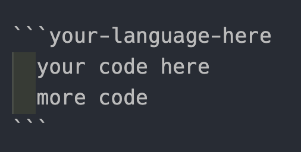
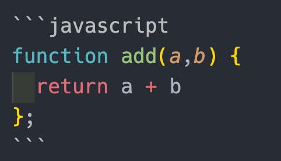
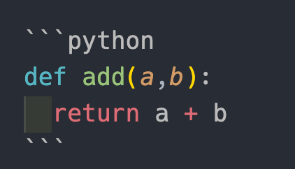

## What is Markdown?

Markdown is a lightweight markup language with a plain text formatting syntax.
It can be converted to HTML and XHTML, among other languages.

The main purpose of Markdown is that the content is easy to read, and easy to use.
You should be able to read a markdown file relatively easy compared to, for example, HTML; without having to render it to a web page.

## What is it used for?

Markdown is mainly used for Readme files (on Github etc.), as well as for forum and blog posts (such as this). It is also used in many static site generators.

## What exactly can you format with Markdown?

You can use markdown for many things! In this post we will talk about these uses:

- Headings
- Emphasis (Like italic and bold)
- Horizontal rules
- Blockquotes
- Links
- Images
- Lists
- Code blocks and syntax highlighting
- Tables

---

## Headings <a href="headings"></a>

Like in HTML, in Markdown you have heading sizes ranging from h1 to h6. However instead of writing them inside <>, in Markdown we uses the _hash sign_ #

So for the largest heading, you would write it like this:

```markdown
# I am heading 1 <!-- The same as an h1 heading -->

## I am heading 2 <!-- The same as an h2 heading -->

### I am heading 3 <!-- The same as an h3 heading -->

#### I am heading 4 <!-- The same as an h4 heading -->

##### I am heading 5 <!-- The same as an h5 heading -->

###### I am heading 6 <!-- The same as an h6 heading -->
```

The above code will show up like this:

# I am Heading 1

## I am Heading 2

### I am Heading 3

#### I am Heading 4

##### I am Heading 5

###### I am Heading 6

---

## Emphasis

Now, we will talk about emphasis. Mainly, we will talk about _italics_, **bold**, and ~~strike-through~~.

If you want text to show up as italicized, all you have to do is surround the text in either underscores(\_) or asterisk(\*).

```markdown
_This text_ is italicized
_This text_ is also italicized
```

(As you can see, it even shows up as italicized in the code block/document!)

The above code will show up like this:

_This text_ is italicized
_This text_ is also italicized

To make text show up as bold, you do the same as with italic, but double it!

```markdown
**This text** is bold
**This text** is also bold
```

The above code will show up like this:

**This text** is bold
**This text** is also bold

For text with ~~strike-through~~ you wrap the desired text in double tilde(~).

```markdown
~~This text~~ is strike-through.
```

---

## Horizontal Rule

Now the horizontal rule; you might have seen me use it already in this document. It's the line break you see throughout my document.

It's very easy: all you do is type three hyphens, or three underscores. Like this:

```markdown
--- <!-- This will show up as a line break in your document-->
\_\_\_ <!-- This will show up as a line break in your document-->
```

---

## Blockquote

You might want to use a quote in your document. To make it show up as indented text, all you have to do is add the (>) symbol before your text.

```markdown
> I am a quote.
```

The above code will show up like this:

> I am a quote
> Nice and indented right?

---

## Links

The syntax for links is like this:

```markdown
[Name of site](link-to-site)
```

Alternatively, if you want the name of the site to show up when you hover the link, you write it like this:

```markdown
[Name of site](link-to-site "Name of site")
```

The above code will show up something like this:

[Try to hover me](https://www.markdownguide.org/ "Wanna learn more about Markdown?")

---

## Images

Images looks a lot like links. In fact, the only change is an (!) before the brackets.

```markdown


<!-- Try this out as an example:-->


```

---

## Lists

There are three types of lists in markdown:
unordered lists, ordered lists, and checklists\*.

**Unordered lists** are written like this:

```markdown
- Item 1
- Item 2
- Item 3
  - Nested Item 1 <!-- Just tab in once to make a nested item-->
  - Nested Item 2
```

It shows up like this:

- Item 1
- Item 2
- Item 3
  - Nested Item 1
  - Nested Item 2

**Ordered lists** are written like this:

```markdown
1. Item 1
1. Item 3
1. Item 3
   1. Nested Item 1
   1. Nested Item 2
   1. Nested Item 3
```

The above code will show up like this:

1. Item 1
1. Item 3
1. Item 3
   1. Nested Item 1
   1. Nested Item 2
   1. Nested Item 3

**Note**: Even though you write the same number 1. on every item, Markdown automatically iterates the numbers for you. Pretty neat.

**Task Lists** are a little different. They are written like this:

```markdown
[x] Task 1
[x] Task 2
[ ] Task 3
```

However, it's a Github-specific flavor of Markdown, so it will only show up as a checklist on a Readme file uploaded to Github.

[x] Task 1
[x] Task 2
[ ] Task 3

---

## Code blocks

There are two different ways of writing blocks of code in markdown. The first way is inline code block:

```markdown
`<p> This is a paragraph </p>`
`<p> They are written inside single backtics </p>`
```

The other way is to be language specific. The way you do that is with three backtics, followed by the name of the preferred language, and then three closing backtics.

Like this:


Yo could do javascript syntax highlighting:



Shows up like this:

```javascript
function add(a, b) {
	return a + b;
}
```

or how about python:



Shows up like this:

```python
def add(a,b):
  return a + b
```

Markdown has syntax highlighting for a lot of different languages, but just how many is out of the scope for this blog post unfortunately.

---

## Tables

Maybe you want to showcase a table of some content in your document. Markdown has you covered for this as well!. The syntax is like this:

```markdown
| Name     | Email          |
| -------- | -------------- |
| John Doe | john@gmail.com |
| Jane Doe | jane@gmail.com |
```

That table will show up like this in your document:

| Name     | Email          |
| -------- | -------------- |
| John Doe | john@gmail.com |
| Jane Doe | jane@gmail.com |

Pretty cool 😎

---

That's it for my Markdown-beginner tips. There are more things you can do, and also different flavors of markdown to explore, but if you're a beginner using Markdown (like me at the moment), these are what I would consider being the most important, most basic stuff to know.

Maybe I'll post more Markdown stuff in the future, who knows.

'Til then; see you next time!
